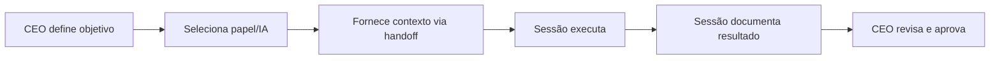

# Governança de Desenvolvimento com IA Distribuída

**Projeto:** Tocantins Integrado
**Versão:** 1.0.0
**Última atualização:** Janeiro 2026

---

## Visão Geral

Este diretório contém o framework de governança para desenvolvimento assistido por múltiplas instâncias de IA, cada uma assumindo um papel organizacional específico.

### Problema que Resolve

1. **Limitação de contexto**: IAs têm janelas de contexto finitas
2. **Sobrecarga cognitiva**: Misturar papéis estratégicos e operacionais gera confusão
3. **Rastreabilidade**: Decisões se perdem entre sessões
4. **Escalabilidade**: Sem estrutura, adicionar novos papéis é caótico

### Solução Proposta

Estrutura organizacional simulada onde:
- Cada **papel** é uma sessão/instância de IA especializada
- **Handoffs** documentados preservam contexto entre papéis
- **Decisões** são registradas de forma padronizada
- O **CEO humano** orquestra e tem autoridade final

---

## Estrutura Organizacional

```
                    ┌─────────────────────┐
                    │   CEO (Humano)      │
                    │   Visão & Decisões  │
                    └──────────┬──────────┘
                               │
        ┌──────────────────────┼──────────────────────┐
        │                      │                      │
        ▼                      ▼                      ▼
┌───────────────┐    ┌───────────────┐    ┌───────────────┐
│  CTO          │    │  CFO          │    │  CMO          │
│  Tecnologia   │    │  Finanças     │    │  Marketing    │
└───────┬───────┘    └───────────────┘    └───────────────┘
        │
        ▼
┌───────────────┐
│  Dev Team     │
│  Implementação│
└───────────────┘
```

---

## Estrutura de Diretórios

```
.governance/
├── README.md                    # Este arquivo
├── METHODOLOGY.md               # Metodologia de trabalho
├── ROLES.md                     # Definição de papéis
├── handoffs/                    # Handoffs entre sessões
│   └── YYYY-MM-DD_ROLE_to_ROLE.md
├── decisions/                   # Registro de decisões (ADR)
│   └── ADR-NNN_titulo.md
├── sessions/                    # Log de sessões
│   └── YYYY-MM-DD_ROLE_summary.md
└── templates/                   # Templates padronizados
    ├── HANDOFF_TEMPLATE.md
    ├── DECISION_TEMPLATE.md
    └── SESSION_TEMPLATE.md
```

---

## Fluxo de Trabalho

### 1. Início de Sessão



### 2. Durante a Sessão

- Cada papel trabalha dentro do seu escopo
- Decisões fora do escopo são escaladas ao CEO
- Artefatos são documentados em tempo real

### 3. Encerramento de Sessão

1. Preencher template de sessão
2. Criar handoff se houver continuidade
3. Registrar decisões tomadas (ADR)
4. CEO valida e arquiva

---

## Documentos de Referência

| Documento | Descrição |
|-----------|-----------|
| [METHODOLOGY.md](./METHODOLOGY.md) | Metodologia completa de trabalho |
| [ROLES.md](./ROLES.md) | Definição detalhada de cada papel |
| [templates/](./templates/) | Templates para documentação |

---

## Comandos Rápidos

```bash
# Criar novo handoff
cp .governance/templates/HANDOFF_TEMPLATE.md \
   .governance/handoffs/$(date +%Y-%m-%d)_CTO_to_DEV.md

# Criar nova decisão
cp .governance/templates/DECISION_TEMPLATE.md \
   .governance/decisions/ADR-001_titulo.md

# Criar log de sessão
cp .governance/templates/SESSION_TEMPLATE.md \
   .governance/sessions/$(date +%Y-%m-%d)_CTO_summary.md
```

---

## Princípios Fundamentais

1. **Documentação é contrato** - O que não está escrito não existe
2. **Escopo limitado** - Cada papel faz apenas o que lhe compete
3. **Decisões explícitas** - Toda escolha importante é registrada
4. **CEO como orquestrador** - Autoridade final sempre do humano
5. **Handoffs completos** - Nunca assumir que o próximo "sabe"

---

*Framework criado em Janeiro 2026*
