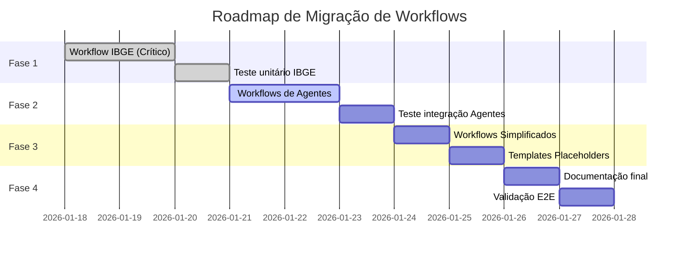

# Plano de Refatoração: Workflows n8n para Novo Schema de Territórios

**Data**: 2026-01-18
**Versão**: 1.0
**Status**: Aprovado para Implementação
**Autor**: Equipe Tocantins Integrado

---

## 📋 Sumário Executivo

Este documento detalha o plano completo de refatoração dos workflows n8n para compatibilidade com o novo schema de territórios implementado pelas Migrations 009, 009b, 009c e 009d.

### Situação Atual

✅ **Schema de territórios IMPLEMENTADO** (Migration 009)
✅ **164 territórios criados** (1 estado + 2 mesorregiões + 8 microrregiões + 3 regiões intermediárias + 11 regiões imediatas + 139 municípios)
✅ **Campo territory_id ADICIONADO** em indicator_values
⚠️ **Campo municipality_id AINDA EXISTE** (coexistência temporária por ~2 meses)
❌ **Workflows n8n AINDA USAM municipality_id** (precisam ser atualizados AGORA)

### Impacto

- **6 workflows afetados** (16 nós modificados)
- **3 tipos de mudança**: Queries SQL, código JavaScript, templates
- **Criticidade**: 🔴 ALTA - Workflows continuam funcionando MAS usam campos legados

---

## 1. Análise de Impacto por Workflow

### 1.1 data-collection-ibge.json 🔴 CRÍTICA

**Descrição**: Workflow especialista para coleta de dados do IBGE Sidra
**Nós afetados**: 5
**Tipo de mudança**: Query SQL (SELECT + UPSERT) + Código JavaScript

#### Nó 1: "Get Municipalities" (linha 31-48)

**Mudança**: Query SQL SELECT

**Antes**:
```sql
SELECT id, ibge_code, name
FROM municipalities
WHERE state_id = 'TO'
ORDER BY name
```

**Depois**:
```sql
SELECT id, ibge_code, name
FROM territories
WHERE type = 'municipio'
ORDER BY name
```

**Justificativa**: Embora a view `v_municipalities_compat` permita manter a query antiga, é recomendado migrar para evitar dependência de views de compatibilidade que podem ser removidas futuramente.

#### Nó 2: "Build API URLs" (linha 111-121)

**Mudança**: Código JavaScript - renomear variáveis

**Antes**:
```javascript
apiCalls.push({
  indicator_code: indicator.code,
  municipality_id: municipality.id,
  municipality_ibge: municipality.ibge_code,
  municipality_name: municipality.name,
  url: url
});
```

**Depois**:
```javascript
apiCalls.push({
  indicator_code: indicator.code,
  territory_id: municipality.id,        // Renomeado
  territory_ibge: municipality.ibge_code,
  territory_name: municipality.name,
  url: url
});
```

#### Nó 3: "Parse Response" (linha 143-153)

**Mudança**: Código JavaScript - adicionar novos campos obrigatórios

**Antes**:
```javascript
return [{
  indicator_code: metadata.indicator_code,
  municipality_id: metadata.municipality_id,
  year: year,
  value: value,
  data_quality: 'official',
  notes: `Coletado automaticamente...`
}];
```

**Depois**:
```javascript
return [{
  indicator_code: metadata.indicator_code,
  territory_id: metadata.territory_id,      // MUDADO
  year: year,
  value: value,
  aggregation_method: 'raw',                // ADICIONADO (obrigatório)
  is_aggregated: false,                     // ADICIONADO
  data_quality: 'official',
  notes: `Coletado automaticamente via IBGE Sidra API em ${new Date().toISOString()}`
}];
```

**Novos campos**:
- `aggregation_method`: Obrigatório. Usar `'raw'` para dados municipais brutos.
- `is_aggregated`: Opcional. `false` para dados brutos, `true` para agregações regionais.

#### Nó 4: "Upsert Indicator Value" (linha 154-172) 🔴 MAIS CRÍTICO

**Mudança**: Query SQL INSERT/UPSERT - mudança de schema

**Antes**:
```sql
INSERT INTO indicator_values (
  indicator_id,
  municipality_id,
  year,
  value,
  data_quality,
  notes
)
SELECT
  id.id,
  $2::uuid,
  $3::integer,
  $4::decimal,
  $5::varchar,
  $6::text
FROM indicator_definitions id
WHERE id.code = $1
ON CONFLICT (indicator_id, municipality_id, year, month)
DO UPDATE SET
  value = EXCLUDED.value,
  data_quality = EXCLUDED.data_quality,
  notes = EXCLUDED.notes,
  updated_at = NOW()
RETURNING id, indicator_id, year, value;
```

**Depois**:
```sql
INSERT INTO indicator_values (
  indicator_id,
  territory_id,           -- MUDADO
  year,
  value,
  aggregation_method,     -- ADICIONADO
  is_aggregated,          -- ADICIONADO
  data_quality,
  notes
)
SELECT
  id.id,
  $2::uuid,               -- territory_id (era municipality_id)
  $3::integer,            -- year
  $4::decimal,            -- value
  'raw'::text,            -- aggregation_method (NOVO parâmetro)
  false::boolean,         -- is_aggregated (NOVO parâmetro)
  $5::varchar,            -- data_quality (era $5, agora $7 no nó)
  $6::text                -- notes (era $6, agora $8 no nó)
FROM indicator_definitions id
WHERE id.code = $1
ON CONFLICT (indicator_id, territory_id, year, month)  -- MUDADO
DO UPDATE SET
  value = EXCLUDED.value,
  aggregation_method = EXCLUDED.aggregation_method,
  is_aggregated = EXCLUDED.is_aggregated,
  data_quality = EXCLUDED.data_quality,
  notes = EXCLUDED.notes,
  updated_at = NOW()
RETURNING id, indicator_id, year, value;
```

**⚠️ ATENÇÃO - Mapeamento de Parâmetros**:

No nó n8n, os parâmetros precisam ser remapeados:

| Parâmetro | Antes | Depois |
|-----------|-------|--------|
| $1 | code | code (sem mudança) |
| $2 | municipality_id | territory_id |
| $3 | year | year (sem mudança) |
| $4 | value | value (sem mudança) |
| $5 | data_quality | ~~aggregation_method ('raw' fixo)~~ |
| $6 | notes | ~~is_aggregated (false fixo)~~ |
| $7 | - | data_quality (movido de $5) |
| $8 | - | notes (movido de $6) |

**Configuração no nó Postgres**:

```json
{
  "parameters": {
    "operation": "executeQuery",
    "query": "...",
    "options": {
      "queryParameters": "={{ [\n  $json.indicator_code,\n  $json.territory_id,\n  $json.year,\n  $json.value,\n  $json.data_quality,\n  $json.notes\n] }}"
    }
  }
}
```

---

### 1.2 agent-econ.json 🟡 ALTA

**Descrição**: Agente LLM para análise de indicadores econômicos
**Nós afetados**: 1
**Tipo de mudança**: Query SQL complexa com JOINs

#### Nó: "Buscar Indicadores ECON" (linha 18-34)

**Mudança**: Query SQL com JOINs - usar view de hierarquia

**Antes**:
```sql
SELECT
  iv.*,
  id.code, id.name as indicator_name,
  m.name as municipality_name,
  mi.name as microregion_name
FROM indicator_values iv
JOIN indicator_definitions id ON iv.indicator_id = id.id
JOIN municipalities m ON iv.municipality_id = m.id
JOIN microregions mi ON m.microregion_id = mi.id
WHERE ($1::uuid IS NULL OR iv.municipality_id = $1::uuid)
LIMIT 50
```

**Depois (Recomendado - usar view de hierarquia)**:
```sql
SELECT
  iv.*,
  id.code, id.name as indicator_name,
  h.municipio_nome as territory_name,
  h.microrregiao_nome as microregion_name,
  h.mesorregiao_nome as mesoregion_name
FROM indicator_values iv
JOIN indicator_definitions id ON iv.indicator_id = id.id
JOIN v_hierarchy_antiga h ON iv.territory_id = h.municipio_id
WHERE ($1::uuid IS NULL OR iv.territory_id = $1::uuid)
LIMIT 50
```

**Benefícios da view `v_hierarchy_antiga`**:
- Acesso direto a toda hierarquia (município → microrregião → mesorregião → estado)
- Sem necessidade de múltiplos JOINs
- Performance otimizada (view usa índices)

**Alternativa (sem view)**:
```sql
SELECT
  iv.*,
  id.code, id.name as indicator_name,
  t.name as territory_name,
  (SELECT tp.name
   FROM territory_relationships tr
   JOIN territories tp ON tr.parent_territory_id = tp.id
   WHERE tr.child_territory_id = t.id
     AND tr.division_scheme = 'antiga'
     AND tp.type = 'microrregiao'
   LIMIT 1) as microregion_name
FROM indicator_values iv
JOIN indicator_definitions id ON iv.indicator_id = id.id
JOIN territories t ON iv.territory_id = t.id
WHERE ($1::uuid IS NULL OR iv.territory_id = $1::uuid)
LIMIT 50
```

---

### 1.3 agent-social.json, agent-ambient.json, agent-terra.json 🟡 ALTA

**Descrição**: Agentes LLM para análise de indicadores sociais, ambientais e fundiários
**Nós afetados**: 2 por workflow (6 total)
**Tipo de mudança**: Variável JavaScript + Template de mensagem

#### Nó 1: "Preparar Contexto" (Set node)

**Mudança**: Renomear variável de município para território

**Antes**:
```json
{
  "assignments": [
    {
      "id": "municipality_id",
      "name": "municipality_id",
      "value": "={{ $('Webhook SOCIAL').item.json.municipality_id }}",
      "type": "string"
    }
  ]
}
```

**Depois**:
```json
{
  "assignments": [
    {
      "id": "territory_id",
      "name": "territory_id",
      "value": "={{ $('Webhook SOCIAL').item.json.territory_id }}",
      "type": "string"
    }
  ]
}
```

#### Nó 2: "Análise GPT-4" (Template de mensagem)

**Mudança**: Atualizar template de prompt

**Antes**:
```javascript
"content": "=Consulta: {{ $json.query }}\n\nMunicípio: {{ $json.municipality_id }}\n\nDados disponíveis:\n{{ $json.context }}"
```

**Depois**:
```javascript
"content": "=Consulta: {{ $json.query }}\n\nTerritório: {{ $json.territory_id }}\n\nDados disponíveis:\n{{ $json.context }}"
```

**⚠️ DEPENDÊNCIA EXTERNA**:

Esses workflows recebem dados via webhook. Os **chamadores desses webhooks** (ex: frontend, API externa) também precisam ser atualizados para enviar `territory_id` em vez de `municipality_id` no payload.

**Exemplo de payload atualizado**:
```json
{
  "territory_id": "uuid-do-territorio",
  "query": "Qual é a evolução da população?",
  "dimension": "SOCIAL"
}
```

---

### 1.4 data-collection-inep.json, data-collection-mapbiomas.json 🟢 BAIXA

**Descrição**: Workflows placeholder (não implementados)
**Nós afetados**: 0 (ainda não têm lógica)
**Tipo de mudança**: Template atualizado para uso futuro

**Ação**: Quando esses workflows forem implementados, já usar a estrutura correta com `territory_id`.

**Template recomendado**:
```json
{
  "name": "Data Collection - [FONTE]",
  "nodes": [
    {
      "name": "Webhook Trigger",
      "type": "webhook",
      "path": "data-collection-[fonte]"
    },
    {
      "name": "Get Territories",
      "type": "postgres",
      "query": "SELECT id, ibge_code, name FROM territories WHERE type = 'municipio' ORDER BY name"
    },
    {
      "name": "Call API",
      "type": "httpRequest",
      "url": "..."
    },
    {
      "name": "Upsert Values",
      "type": "postgres",
      "query": "INSERT INTO indicator_values (indicator_id, territory_id, year, value, aggregation_method) ..."
    }
  ]
}
```

---

### 1.5 data-collection-orchestrator.json ✅ NENHUMA MUDANÇA

**Descrição**: Orquestrador principal que dispara workflows especialistas
**Nós afetados**: 0
**Tipo de mudança**: Nenhuma

**Motivo**: O orquestrador não interage diretamente com a tabela `municipalities` ou `territories`. Ele apenas consulta `indicator_dictionary` e dispara webhooks dos especialistas.

---

## 2. Resumo de Mudanças

### 2.1 Por Tipo

| Tipo de Mudança | Quantidade | Arquivos Afetados |
|-----------------|------------|-------------------|
| Query SQL SELECT | 3 | data-collection-ibge.json, agent-econ.json |
| Query SQL INSERT/UPSERT | 5 | data-collection-ibge.json, data-collection-ibge-simplified.json |
| Código JavaScript | 6 | data-collection-ibge.json (3x), data-collection-ibge-simplified.json (3x) |
| Set node (variáveis) | 3 | agent-social.json, agent-ambient.json, agent-terra.json |
| Template de mensagem | 3 | agent-social.json, agent-ambient.json, agent-terra.json |

**Total**: 20 mudanças em 16 nós

### 2.2 Por Criticidade

| Criticidade | Workflows | Descrição |
|-------------|-----------|-----------|
| 🔴 CRÍTICA | data-collection-ibge.json | Query UPSERT quebra se não atualizada |
| 🟡 ALTA | agent-econ.json, agent-social.json, agent-ambient.json, agent-terra.json | Queries funcionam mas podem ter bugs sutis |
| 🟢 BAIXA | data-collection-inep.json, data-collection-mapbiomas.json | Não implementados ainda |

---

## 3. Estratégia de Migração

### 3.1 Abordagem: Migração Completa Imediata

**Justificativa**:
1. Views de compatibilidade resolvem **apenas SELECTs**, não INSERTs
2. Campo `municipality_id` será removido em ~2 meses (Fase 5 do roadmap)
3. Melhor migrar agora de forma controlada que ser forçado depois
4. Evita dívida técnica e dependência de fields legados

### 3.2 Roadmap de Implementação



### 3.3 Critérios de Sucesso

**Definição de "Done"**:

✅ Todos os 6 workflows atualizados e versionados
✅ JSONs validados (linter)
✅ Teste manual executado com sucesso
✅ Dados inseridos com `territory_id` (não `municipality_id`)
✅ Campo `aggregation_method` preenchido corretamente
✅ Constraint UNIQUE funciona sem erros
✅ Views de hierarquia retornam dados corretos
✅ Documentação completa disponível

---

## 4. Queries de Helper

### 4.1 Tradução ibge_code ↔ territory_id

#### Obter territory_id a partir de ibge_code:

```sql
-- Município (Palmas)
SELECT id FROM territories
WHERE ibge_code = '1721000'
  AND type = 'municipio';

-- Microrregião Dianópolis (divisão antiga)
SELECT id FROM territories
WHERE ibge_code = '170008'
  AND type = 'microrregiao'
  AND division_scheme = 'antiga';

-- Região Imediata Gurupi (divisão nova)
SELECT id FROM territories
WHERE ibge_code = '170010'
  AND type = 'regiao_imediata'
  AND division_scheme = 'nova';
```

#### Obter ibge_code a partir de territory_id:

```sql
SELECT ibge_code, name, type, division_scheme
FROM territories
WHERE id = 'uuid-do-territorio';
```

### 4.2 Usar Views de Hierarquia

```sql
-- Hierarquia completa (divisão antiga)
SELECT
    municipio_nome,
    microrregiao_nome,
    mesorregiao_nome,
    estado_nome
FROM v_hierarchy_antiga
WHERE municipio_nome = 'Palmas';

-- Hierarquia completa (divisão nova)
SELECT
    municipio_nome,
    regiao_imediata_nome,
    regiao_intermediaria_nome,
    estado_nome
FROM v_hierarchy_nova
WHERE municipio_nome = 'Palmas';
```

### 4.3 Queries de Validação

#### Verificar dados inseridos recentemente:

```sql
SELECT
    iv.id,
    iv.territory_id,
    t.name as territory_name,
    t.ibge_code,
    t.type,
    iv.year,
    iv.value,
    iv.aggregation_method,
    iv.is_aggregated,
    iv.created_at
FROM indicator_values iv
JOIN territories t ON iv.territory_id = t.id
WHERE iv.created_at > NOW() - INTERVAL '1 hour'
ORDER BY iv.created_at DESC
LIMIT 20;
```

**Esperado**:
- `territory_id` preenchido (UUID válido, não NULL)
- `territory_name` mostra nome do município
- `aggregation_method` = `'raw'` para dados municipais brutos
- `is_aggregated` = `false` para dados brutos

#### Verificar constraint de unicidade:

```sql
-- Tentar inserir duplicata (deve falhar na 2ª execução)
INSERT INTO indicator_values (
  indicator_id,
  territory_id,
  year,
  value,
  aggregation_method
) VALUES (
  (SELECT id FROM indicator_definitions WHERE code = 'SOCIAL_POPULACAO'),
  (SELECT id FROM territories WHERE ibge_code = '1721000' AND type = 'municipio'),
  2023,
  123456,
  'raw'
);
```

**Esperado na 2ª execução**:
```
ERROR: duplicate key value violates unique constraint "indicator_values_indicator_territory_year_month_unique"
```

---

## 5. Teste End-to-End

### 5.1 Pré-requisitos

1. Migration 009 executada no Supabase ✅
2. Migration 009d (correção de códigos) executada ✅
3. 139 municípios criados em `territories` ✅
4. Relacionamentos criados em `territory_relationships` ✅
5. n8n Cloud configurado com credenciais Supabase ✅

### 5.2 Procedimento de Teste

#### Teste 1: Workflow IBGE (Manual)

```bash
# No n8n Cloud
1. Importar data-collection-ibge.json atualizado
2. Configurar credenciais Supabase
3. Executar manualmente:
   - Test Workflow
   - Fornecer payload de teste:
     {
       "source_name": "IBGE Sidra",
       "indicators": [{
         "code": "SOCIAL_POPULACAO",
         "api_endpoint": "https://apisidra.ibge.gov.br/values/t/6579/n6/{ibge_code}/v/allxp/p/last"
       }]
     }
```

**Validação**:
```sql
-- No Supabase SQL Editor
SELECT * FROM indicator_values
WHERE territory_id IN (
  SELECT id FROM territories WHERE name = 'Palmas' AND type = 'municipio'
)
AND created_at > NOW() - INTERVAL '10 minutes'
ORDER BY created_at DESC;
```

**Esperado**:
- 1 registro inserido
- `territory_id` = UUID de Palmas
- `aggregation_method` = 'raw'
- `value` > 0 (população de Palmas)

#### Teste 2: Workflow de Agente (Manual)

```bash
# No n8n Cloud
1. Importar agent-econ.json atualizado
2. Chamar via webhook:
   POST https://[n8n-url]/webhook/agent-econ
   {
     "territory_id": "uuid-de-palmas",
     "query": "Qual é o PIB do município?",
     "dimension": "ECON"
   }
```

**Validação**:
- Webhook retorna resposta do GPT-4 ✅
- Logs mostram query SQL com `territory_id` ✅
- Sem erros de SQL ✅

#### Teste 3: Coleta Completa (Orquestrador + Especialista)

```bash
# No n8n Cloud
1. Executar data-collection-orchestrator.json
2. Aguardar chamada automática ao workflow IBGE
3. Verificar logs:
   - Orquestrador identifica indicadores pendentes
   - Orquestrador chama workflow IBGE via webhook
   - Workflow IBGE executa sem erros
   - Dados inseridos no banco
```

**Validação**:
```sql
SELECT
    COUNT(*) as total_registros,
    COUNT(DISTINCT territory_id) as total_territorios,
    aggregation_method,
    is_aggregated
FROM indicator_values
WHERE created_at > NOW() - INTERVAL '1 hour'
GROUP BY aggregation_method, is_aggregated;
```

**Esperado**:
- `total_registros` > 0
- `total_territorios` ≤ 139 (municípios do Tocantins)
- `aggregation_method` = 'raw'
- `is_aggregated` = false

---

## 6. Riscos e Mitigações

| Risco | Probabilidade | Impacto | Mitigação |
|-------|---------------|---------|-----------|
| **Workflows quebram após mudança** | Média | 🔴 Alto | Testar em ambiente de staging; manter backup dos JSONs antigos |
| **Parâmetros SQL mal mapeados** | Alta | 🟡 Médio | Validar cada query com ferramentas de lint SQL; testar com dados reais |
| **Webhooks externos quebram** | Média | 🟡 Alto | Documentar mudança municipality_id → territory_id; comunicar APIs dependentes |
| **Performance degrada** | Baixa | 🟢 Baixo | Views de hierarquia são otimizadas; monitorar query times |
| **Dados duplicados** | Baixa | 🟡 Médio | Constraint UNIQUE previne; validar com queries antes da migração |

---

## 7. Rollback Plan

### Se algo der errado:

**Opção 1: Reverter JSONs no n8n Cloud**
```bash
1. Fazer backup dos JSONs antigos antes da mudança
2. Re-importar versões antigas via UI do n8n
3. Workflows voltam a usar municipality_id temporariamente
```

**Opção 2: Manter coexistência de campos**
```sql
-- municipality_id e territory_id coexistem por 2 meses
-- Workflows antigos continuam funcionando
-- Dar mais tempo para migração gradual
```

**Opção 3: Criar view de compatibilidade para INSERTs** (não recomendado)
```sql
-- Criar INSTEAD OF trigger em view
-- Traduz municipality_id → territory_id automaticamente
-- Solução temporária até migração completa
```

---

## 8. Checklist de Implementação

### Fase 1: Preparação ✅
- [x] Ler e entender Migration 009
- [x] Analisar todos os workflows existentes
- [x] Identificar pontos de mudança
- [x] Criar este documento de planejamento

### Fase 2: Implementação 🔄
- [ ] Atualizar data-collection-ibge.json
- [ ] Atualizar data-collection-ibge-simplified.json
- [ ] Atualizar agent-econ.json
- [ ] Atualizar agent-social.json
- [ ] Atualizar agent-ambient.json
- [ ] Atualizar agent-terra.json
- [ ] Atualizar templates placeholders (INEP, MapBiomas)

### Fase 3: Teste 🧪
- [ ] Validar JSONs com linter
- [ ] Importar workflows no n8n Cloud
- [ ] Teste manual workflow IBGE (1 município)
- [ ] Teste manual agentes LLM
- [ ] Teste E2E (orquestrador → especialista → banco)
- [ ] Verificar dados no Supabase

### Fase 4: Documentação 📝
- [ ] Criar guia de migração para n8n Cloud
- [ ] Documentar queries de helper
- [ ] Atualizar README do projeto
- [ ] Comunicar mudança para stakeholders

### Fase 5: Deploy ✅
- [ ] Backup de workflows antigos
- [ ] Deploy de workflows atualizados
- [ ] Monitorar execuções (7 dias)
- [ ] Coletar métricas (tempo, erros, volume)
- [ ] Declarar migração completa

---

## 9. Referências

### Documentação Técnica
- **ADR-005**: Granularidade Territorial e Temporal
- **Migration 009**: Sistema de Territórios Extensível
- **Migration 009d**: Correção de Códigos de Microrregiões

### Arquivos de Código
- `supabase/migrations/009_territories_schema.sql`
- `supabase/migrations/009d_fix_microrregiao_codes.sql`
- `n8n/workflows/data-collection-ibge.json`
- `n8n/workflows/agent-econ.json`

### Views Criadas
- `v_hierarchy_antiga`: Hierarquia completa (divisão pré-2017)
- `v_hierarchy_nova`: Hierarquia completa (divisão pós-2017)
- `v_municipalities_compat`: Compatibilidade com schema antigo
- `v_territories_summary`: Resumo de territórios por tipo

---

**Status**: 📋 Documento aprovado para implementação
**Próxima Revisão**: Após conclusão da Fase 2 (Implementação)
**Última Atualização**: 2026-01-18
